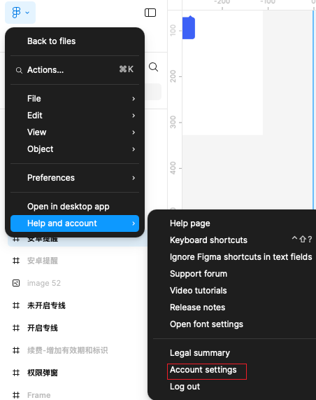
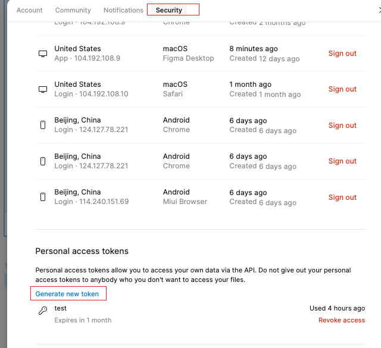
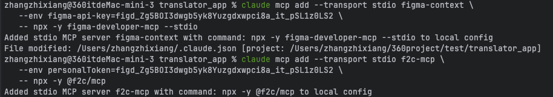

claude 配置

1. 公司claude 安装教程 https://geelib.qihoo.net/geelib/knowledge/doc?docId=263201&spaceId=3293
2. 个人 ApiKey:https://ai.geelib.360.cn/codeWeb/personal/info

获取 figma 的 Figma API 密钥

1. 登录 Figma 账户,https://www.figma.com
2. 进入账户设置（Account Settings）
3. 找到 "Security" ,划到最下面
4. 点击 "Create new token" 创建新的个人访问令牌
   这个密钥将用于认证 Figma API 请求，允许访问私有文件和执行更多操作。请确保将密钥保密，不要公开分享。
   需要注意的是，对于公开的 Figma 文件，通常不需要 API 密钥即可访问基本内容。但如果您需要访问私有文件或进行写操作，则需要有效的API
   密钥。

Mcp 配置

1. 在终端里输入 claude,进入 claude 界面
2. 输入指令 :
   claude mcp add --transport stdio f2c-mcp \
   --env personalToken=XXXXXX \
   -- npx -y @f2c/mcp
   

使用

1. 生成 figma 链接,右上角 share --> Copy link
2. 在终端里输入:用 figmamcp 工具获取数据：https://www.figma.com/file/your-design-file, 之后转换成
   flutter 代码

个人使用示例prompt：

1. https://www.figma.com/design/XXXXX
   @modules/learn_lib/.claude/agents/figma-to-flutter-converter.md 用 mcp 工具看到这个内容描述一下
   （claude这时候的回复，大概会描述一下界面，以此我们判断是否UI 正确，问是否要切换成代码，路径放在哪）
2. 帮我转换，放到 module/translator_lib/lib/src/pages/video
3. 改一下内容，背景的图片Asseiamge 中需要加入 package: 'translator_lib'，背景图片是覆盖整个屏幕的...等
4. 请借鉴其他的代码，把按钮功能补全

subagent 提示词更改

1. 在终端里输入 claude,进入 claude 界面
2. 在终端里输入 /agents,选择需要更改的 subagent,并进行更改